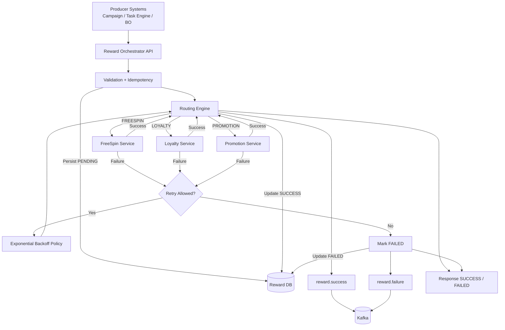

## 1. Objective

Build a **Reward Orchestrator service** that acts as a centralized gateway between **reward intent** and **reward execution**.

## 2. Background & Problem Statement

Currently, reward execution is distributed across multiple services such as:

- Free Spin
- Fire Bonus
- Lucky Wheel

This leads to:

- Multiple integrations per client
- Duplication of logic (validation, retry, deduplication)
- Increased complexity and poor maintainability

## 3. Responsibilities

### 3.1 Receiving & Validating Reward Requests

- Accept reward requests from multiple upstream systems
- Validate request payload and required fields
### 3.2 Standardization

- Normalize reward processing across all reward types
- Ensure consistent processing flow
### 3.3 Reward Service Routing

- Route rewards to appropriate domain services
- Support multiple reward types
### 3.4 Reward Lifecycle Management

- Track reward status transitions:
	- `PENDING → PROCESSING → SUCCESS / FAILED`
### 3.5 Reliability

- Ensure idempotency
- Handle deduplication
- Manage failures within synchronous execution
### 3.6 Audit & Observability

- Maintain logs and execution history
- Enable traceability for debugging

## 4. High-Level Architecture

### 4.1 System Flow (Synchronous)

## 5. Components

### 5.1 Producer Layer

- External systems initiating reward requests
- Examples:
    - Task Engine
    - Campaign Engine
    - Deposit/Invoice Service
    - Back Office
    - VIP / Referral Systems
- Responsibility:
	- Send reward intent to Orchestrator API
## 5.2 Reward Orchestrator API

- Entry point for all reward requests
- Responsibilities:
    - Accept synchronous requests
    - Validate request structure
    - Enforce idempotency
    - Trigger routing engine
    - Return final response (SUCCESS / FAILED)
## 5.3 Validation + Idempotency Layer

- Ensures request correctness before processing
- Responsibilities:
    - Schema validation
    - Business rule validation
    - Deduplication (idempotency key check)
    - Prevent duplicate reward execution
## 5.4 Routing Engine

- Core decision-making component
- Responsibilities:
    - Determine reward type
    - Route request to correct domain service:
        - FreeSpin Service
        - Loyalty Service
        - Promotion Service

## 5.5 Domain Services

Each reward type is handled by a dedicated service:

| Reward Type      | Service                         |
| ---------------- | ------------------------------- |
| FREESPIN         | Freespin Service                |
| LOYALTY_POINT    | Loyalty Service                 |
| LUCKY_WHEEL_TURN | Lucky Wheel Service             |
| DEPOSIT          | Promotion / Transaction Service |
| GIFTCODE         | GiftCode Service                |

## 5.6 Retry & Backoff Policy Engine

- Handles transient failure recovery
- Responsibilities:
    - Decide retry eligibility
    - Apply exponential backoff strategy
    - Re-trigger routing engine if retry is allowed
- Ensures:
    - Controlled retry attempts
    - No infinite retry loops
## 5.7 Persistence Layer (Reward DB)

- System of record for reward processing
- Stores:
    - Request details
    - Status (PENDING / SUCCESS / FAILED)
    - Execution metadata
- Ensures traceability and auditability
## 5.8 Kafka (Event Stream System)

### Topics:

- `reward.success`
- `reward.failure`
### Responsibilities:

- Publish final reward outcomes only
- Used for:
    - Analytics dashboards
    - Reporting systems
    - Business metrics
    - Monitoring pipelines
## 5.9 Response Layer

- Returns final synchronous response to producer
- Possible outcomes:
    - SUCCESS → reward executed successfully
    - FAILED → all retries exhausted or execution failed

# 6. Reward Lifecycle Status Model

## 6.1 Status Enum

RECEIVED  
VALIDATED  
PROCESSING  
SUCCESS  
FAILED
## 6.2 Status Meaning

### RECEIVED
- Request accepted by API
### VALIDATED
- Passed schema + business validation
### PROCESSING
- Sent to domain service
### SUCCESS
- Reward successfully applied
### FAILED
- Final failure after retries exhausted

## 7. Error Code Registry

| ID   | Code                         | Category        | HTTP | Retryable | Description |
|------|------------------------------|----------------|------|-----------|-------------|
| 1000 | REWARD_SUCCESS              | SUCCESS        | 200  | No        | Reward processed successfully |
| 1001 | VALIDATION_FAILED           | VALIDATION     | 400  | No        | Request validation failed |
| 1002 | MISSING_REQUIRED_FIELD      | VALIDATION     | 400  | No        | Required field missing |
| 1003 | INVALID_REWARD_TYPE         | VALIDATION     | 400  | No        | Unsupported reward type |
| 1004 | INVALID_AMOUNT              | VALIDATION     | 400  | No        | Invalid numeric value |
| 1100 | DUPLICATE_REQUEST           | IDEMPOTENCY    | 409  | No        | Duplicate request detected |
| 1101 | REWARD_ALREADY_PROCESSED    | IDEMPOTENCY    | 409  | No        | Reward already executed |
| 2000 | FREESPIN_SERVICE_FAILED     | DOWNSTREAM     | 502  | Yes       | FreeSpin service failure |
| 2001 | LOYALTY_SERVICE_FAILED      | DOWNSTREAM     | 502  | Yes       | Loyalty service failure |
| 2002 | PROMOTION_SERVICE_FAILED    | DOWNSTREAM     | 502  | Yes       | Promotion service failure |
| 2003 | DOWNSTREAM_TIMEOUT          | DOWNSTREAM     | 504  | Yes       | Timeout from downstream |
| 2004 | DOWNSTREAM_UNAVAILABLE      | DOWNSTREAM     | 503  | Yes       | Service unavailable |
| 3000 | RATE_LIMIT_EXCEEDED         | TRANSIENT      | 429  | Yes       | Too many requests |
| 3001 | RETRY_EXHAUSTED             | TRANSIENT      | 500  | No        | Max retries exceeded |
| 4000 | DATABASE_ERROR              | SYSTEM         | 500  | Yes       | DB operation failed |
| 4001 | CACHE_FAILURE               | SYSTEM         | 500  | Yes       | Cache / idempotency store failure |
| 5000 | INTERNAL_SERVER_ERROR       | SYSTEM         | 500  | No        | Unexpected system error |

## 8. Audit & Observability

Track and store:
- `requestId`, `userId`, `rewardType`
- Request payload
- Status and error details
- Timestamps

Support:
- Logging
- Distributed tracing (correlationId)
- Metrics (success/failure rate, latency)
## 9. Non-Functional Requirements

- High throughput and scalability
- Strong idempotency guarantees
- Full observability (logs, metrics, tracing)
- Loose coupling between systems
- Fault-tolerant and resilient design
